# Knowledge-Base Pipeline — Detailed Architecture Diagram

This document diagrams `pipeline.build_knowledge_base(cfg)` (`src/doc_agent/pipeline.py`) as it
**actually runs today**, not as originally sketched — every box below is checked against the real
source (file:line references throughout) and against the real `configs/config.yaml`, not against
what any stage's docstring or `design_choices.md` row *claims* it does. Where the two disagree,
that disagreement is called out explicitly rather than smoothed over (see §5).

Section 1 is the black-box overview (Person C's own stage — Stage 4 — is one box in it, same as
everyone else's). Section 2 opens each box up into its own detailed diagram. Section 3 diagrams the
cross-cutting hook wiring and exactly where it currently breaks. Section 4 traces one piece of data
(the evidence tier of a single OCR'd line) end-to-end through every renaming it undergoes. Section 5
is the config-vs-code drift table. Section 6 is the full artifact manifest.

---

## 0. Status legend

| Symbol | Meaning |
|---|---|
| ✅ | Implemented and exercised by a passing test in this repo |
| ⛔ | Implemented as a stub — `raise NotImplementedError` on the real code path |
| 🟡 | Implemented, but not yet exercised against the real 437-page corpus (demo/synthetic-scale only) |
| 🔒 | Fixed/locked by `STRUCTURE.md` — not editable by any stage owner |

---

## 1. Overview — the pipeline as one black-box chain

```mermaid
flowchart LR
    classDef done fill:#1b4332,stroke:#40916c,color:#d8f3dc,stroke-width:2px
    classDef blocked fill:#5c1a1a,stroke:#e63946,color:#ffe5e5,stroke-width:2px
    classDef locked fill:#1d2b53,stroke:#4361ee,color:#dbe4ff,stroke-width:2px

    RAW["data/raw/&lt;doc_id&gt;/*.png<br/>437 pages, 300 DPI<br/>(scripts/get_data.sh)"]

    subgraph S0["Stage 0 — Ingest<br/>ingest/loader.py"]
        L0["load_pages(cfg)<br/>→ list[Page]"]
    end
    class S0 done

    subgraph S1a["Stage 1a — Preprocess<br/>ingest/preprocess.py"]
        P1["run(pages, cfg)<br/>deskew→denoise→binarize→blank-filter<br/>→ list[Page] (fewer)"]
    end
    class S1a done

    subgraph S1b["Stage 1b — Enhance<br/>ingest/enhance.py"]
        E1["run(pages, cfg)<br/>Enhancer(cfg).apply(pages)<br/>enhance.enabled: true in config.yaml"]
    end
    class S1b blocked

    HOOK1(["hooks.run(AFTER_INGEST, …)<br/>0 handlers registered — no-op today"])

    subgraph S2["Stage 2 — Layout<br/>vision/layout.py"]
        D2["detect(pages, cfg)<br/>pytesseract.image_to_data<br/>→ list[Region] + layout_meta.jsonl"]
    end
    class S2 done

    subgraph S3["Stage 3 — OCR<br/>vision/ocr.py"]
        T3["transcribe(regions, cfg)<br/>per-line crop+re-OCR, CER gate<br/>→ list[Chunk] (line-level) + ocr_meta.jsonl"]
    end
    class S3 done

    HOOK2(["hooks.run(AFTER_OCR, …)<br/>governance/pii.py::_scrub registered<br/>⛔ raise NotImplementedError"])
    class HOOK2 blocked

    subgraph S4a["Stage 4a — Chunk (mine)<br/>index/chunk.py"]
        C4["split(chunks, cfg)<br/>sliding window, chunk_tokens=256/overlap=32<br/>→ list[Chunk] (merged) + chunk_meta.jsonl"]
    end
    class S4a done

    HOOK3(["hooks.run(BEFORE_INDEX, …)<br/>0 handlers registered — no-op today"])

    subgraph S4b["Stage 4b — Embed (mine)<br/>index/embed.py"]
        M4["encode(chunks, cfg)<br/>multilingual-e5-base, passage: prefix<br/>→ np.ndarray (N, 768) float32"]
    end
    class S4b done

    subgraph S4c["Stage 4c — Store (mine)<br/>index/store.py"]
        B4["build(chunks, vectors, cfg)<br/>faiss:hnsw, METRIC_INNER_PRODUCT<br/>→ index.faiss + chunks.jsonl"]
    end
    class S4c done

    OUT[("data/processed/index/<br/>index.faiss + chunks.jsonl<br/>ready for retrieval/retriever.py (A3)")]

    RAW --> L0 --> P1 --> E1 --> HOOK1 --> D2 --> T3 --> HOOK2 --> C4 --> HOOK3 --> M4 --> B4 --> OUT
```

**Reading this diagram honestly:** the red boxes are not hypothetical — `tests/test_retrieval.py`'s
`test_build_knowledge_base_blocked_by_enhance_stub_with_current_config` and
`test_build_knowledge_base_blocked_by_pii_stub_once_enhance_disabled` (Milestone 18) prove, right
now, that a call to `pipeline.build_knowledge_base(cfg)` with the live `config.yaml` never actually
reaches Stage 4a. It dies inside Stage 1b first. This diagram is drawn to show the whole intended
chain, with the two real breakpoints marked exactly where they are — not to imply the pipeline
currently runs end-to-end, which it does not (see DP-3 in the plan).

---

## 2. Stage-by-stage detail

Each subsection unpacks one black box from Section 1. Stages 0–3 are read-only context for Person C
(owned by the ingest/vision stages) — included in full detail because Stage 4's correctness depends
on understanding exactly what `Chunk` objects and `ocr_meta.jsonl` rows look like when they arrive.
Stages 4a–4c are Person C's own code, unpacked in the most detail.

### 2.0 Stage 0 — Ingest (`ingest/loader.py::load_pages`)

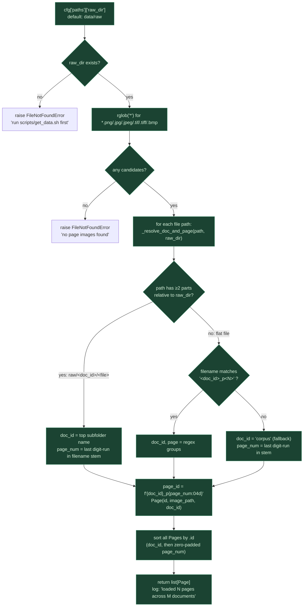

**Why this matters to Stage 4 (mine):** `doc_id` is assigned *here*, at the very first stage, purely
from directory/filename structure — and `chunk.split()`'s core leakage guarantee (never merge lines
across `doc_id`, tested in Milestone 4 / `test_split_never_merges_across_documents`) is only as
correct as this resolution logic. If `scripts/get_data.sh`'s flat single-`doc_id` layout
(`data/raw/rachanabali_vol25/*.png`, no per-work subfolders — see DP-1) is used as-is, every page
resolves to the *same* `doc_id`, and the leakage guarantee becomes vacuous (nothing to leak across,
because there's only one document). That's not a chunk.py bug — it's exactly why DP-1 flags the
real corpus run as blocked on more than just Tesseract.

### 2.1 Stage 1a — Preprocess (`ingest/preprocess.py::run`)

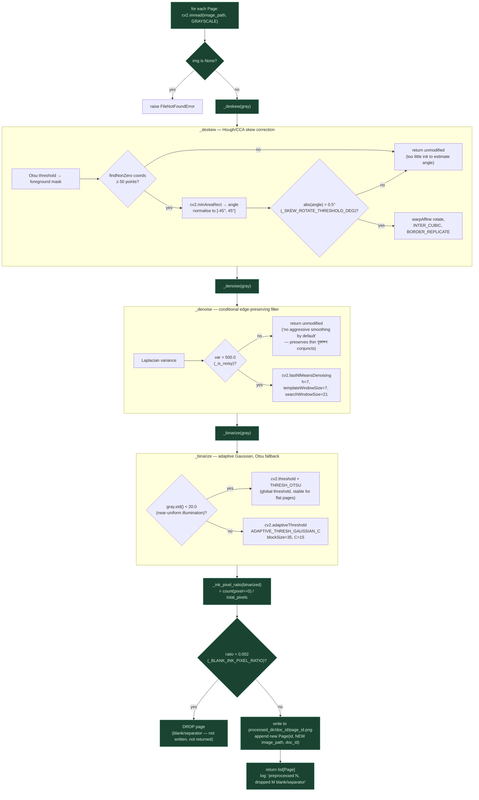

**Why this matters to Stage 4 (mine):** a dropped blank page here never reaches `chunk.split()` at
all — there's no line-level `Chunk`, no `ocr_meta.jsonl` row, nothing to merge or skip. The 3-line
"if `n == 0`: continue" guard inside `chunk.split()`'s per-`doc_id` loop (`chunk.py:80-81`) exists
precisely because an entire document could theoretically be preprocessed down to zero surviving
pages (or zero accepted OCR lines — see 2.4), and Stage 4 has to tolerate an empty `by_doc[doc_id]`
list without crashing.

### 2.2 Stage 1b — Enhance (`ingest/enhance.py::run`) — ⛔ currently blocked (DP-3)

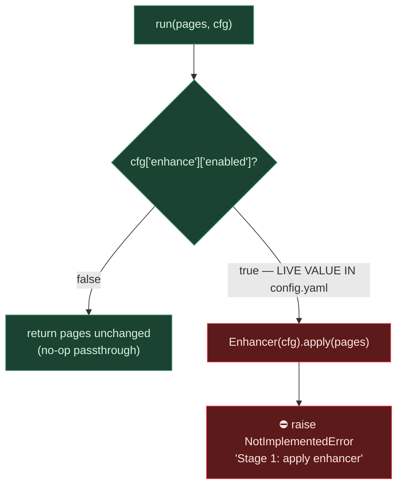

**This is DP-3's first breakpoint, confirmed by `test_build_knowledge_base_blocked_by_enhance_stub_with_current_config`
(Milestone 18).** With `enhance.enabled: true` (the live value in `configs/config.yaml:5`), every
call to `pipeline.build_knowledge_base(cfg)` dies here — before `hooks.AFTER_INGEST` even fires,
before Stage 2/3/4 ever run. Not `ingest/enhance.py`'s file to fix (out of Person C's scope) — but
the diagram has to be honest that this is where the real chain currently stops, since drawing a
clean unbroken arrow through this box would misrepresent the repo's actual state.

### 2.3 Stage 2 — Layout (`vision/layout.py::detect`)

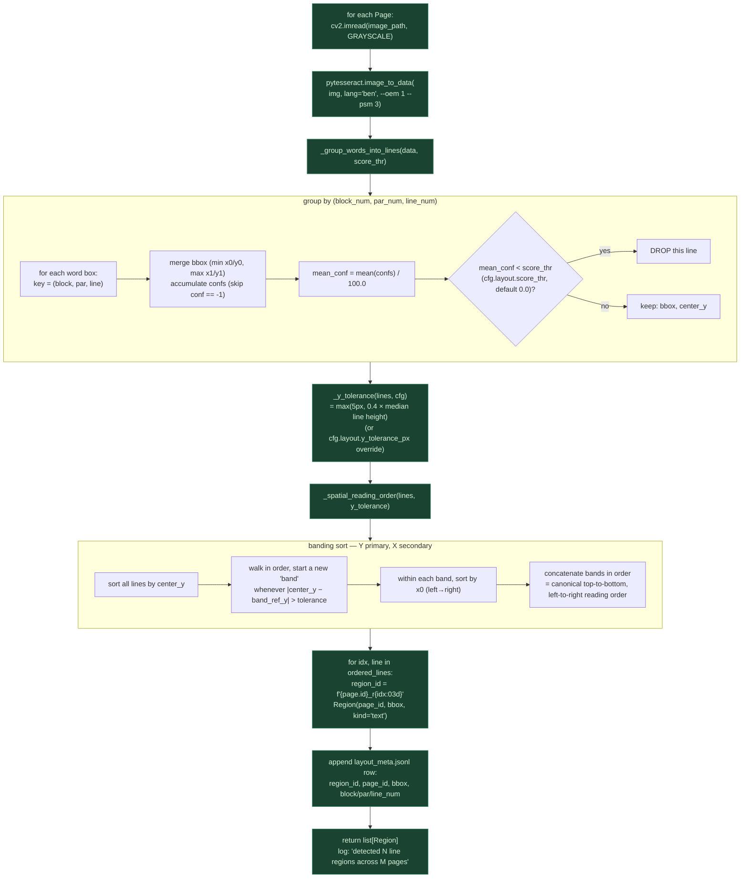

**Why this matters to Stage 4 (mine):** the reading order established here (banding by row, then
left-to-right within a row) is what `chunk.split()` trusts implicitly — it never re-sorts input
lines, only groups them by `doc_id` and flattens in arrival order (`chunk.py:58-59`'s own comment:
*"loader/ocr already sort by page_id, and within a page by top-to-bottom y, so this preserves
reading order"*). A layout bug here (e.g. two-column text banded incorrectly) would silently corrupt
every downstream chunk's word order without `chunk.split()` ever raising an error — it has no way to
detect that its input arrived out of order.

### 2.4 Stage 3 — OCR (`vision/ocr.py::transcribe`) — the evidence-tier gate

This is the most decision-heavy stage in the whole pipeline — four sequential checks per line,
first-match-wins, and it's the stage that actually *writes* the `evidence_tier` field
`chunk.split()` reads (the historical source of the Milestone 1 bug fix).

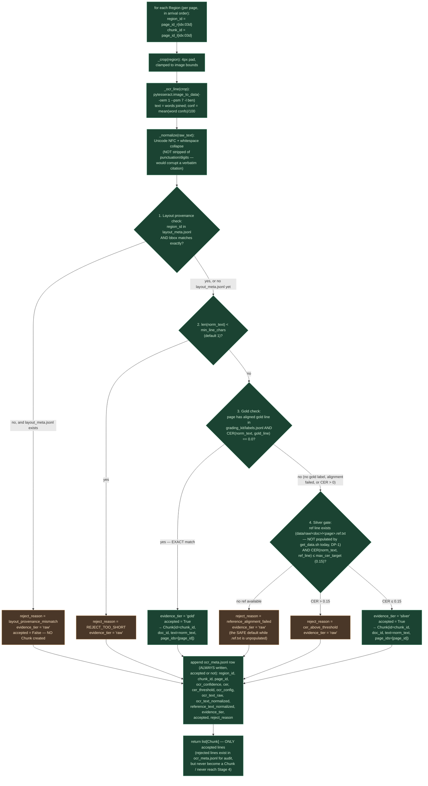

**Why this matters to Stage 4 (mine) — this is the exact contract `chunk.split()` depends on:**

- Every `Chunk` handed to `chunk.split()` is **already accepted** — `chunk.split()` never sees a
  rejected line, so it never needs to re-check quality, only re-window already-trustworthy text.
- `ocr_meta.jsonl`'s key is `"evidence_tier"` (`ocr.py:285`, `:302`, `:309`, `:323`, `:335`,
  `:343`, `:347`) — this is the exact key `chunk.split()` reads at `chunk.py:96`, and the bug this
  repo's Milestone 1 fixed was `chunk.py` reading a key (`"tier"`) that literally does not exist in
  this dict, guaranteed `KeyError` on any real OCR output with at least one accepted line.
- `chunk_id` is assigned **here**, at Stage 3 (`f"{page_id}_l{idx:03d}"`, `ocr.py:269`) — Stage 4's
  merged-chunk IDs (`f"{doc_id}_c{idx:05d}"`, `chunk.py:91`) are a *different* ID space entirely;
  the mapping between them lives in `chunk_meta.jsonl`'s `source_line_ids` field.
- Right now, with no `.ref.txt` files populated by `scripts/get_data.sh` (DP-1) and
  `grading_kit/labels.jsonl` holding only one placeholder row (DP-2), **every line on the real
  corpus would currently fall through to `reject_reason = reference_alignment_failed`** — meaning a
  real 437-page run, even once DP-3's two stub blockers are fixed, would produce **zero** accepted
  `Chunk`s and an empty index, until either `.ref.txt` sidecars or real `labels.jsonl` gold rows
  exist. This is a third, independent prerequisite for DP-1's "real corpus run," not previously
  spelled out this explicitly — flagging it here because tracing the OCR gate line-by-line is what
  surfaced it.

### 2.5 Stage 4a — Chunk (`index/chunk.py::split`) — mine

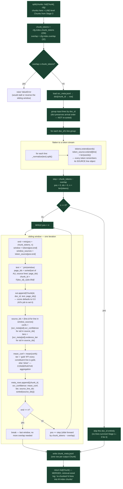

**Two invariants this diagram makes visually obvious** (both locked down by Milestones 3–4's
tests): (1) the `by_doc` grouping means the sliding window **never** crosses a `doc_id` boundary —
there is no code path where `tokens` mixes two documents' words; (2) `page_ids` on a merged chunk is
always the **union** of every source line's `page_ids` touched by that window, not just the first or
last line's — necessary because a 256-token window can legitimately span several physical pages.

### 2.6 Stage 4b — Embed (`index/embed.py::encode`) — mine

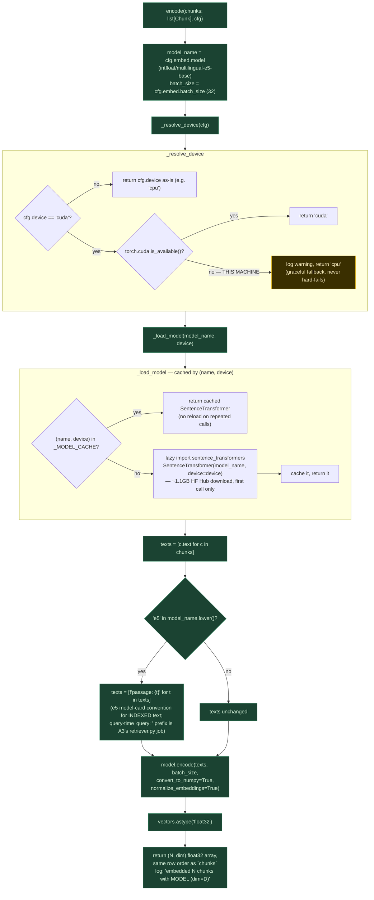

**Why the L2-normalization step matters downstream:** Stage 4c's FAISS index is built with
`METRIC_INNER_PRODUCT` — inner product of two *unit* vectors is exactly cosine similarity, but inner
product of un-normalized vectors is not a similarity metric at all (it's dominated by vector
magnitude). `normalize_embeddings=True` here is what makes Stage 4c's `METRIC_INNER_PRODUCT` choice
valid in the first place — the two stages are coupled through this one assumption, tested explicitly
by `test_encode_output_shape_dtype_and_unit_norm` (Milestone 9) and
`test_store_nearest_neighbor_returns_exact_match` (Milestone 14, which searches with a chunk's own
*already-normalized* vector and expects score ≈ 1.0 — that assertion is only meaningful because
normalization happened upstream).

### 2.7 Stage 4c — Store (`index/store.py::build` / `load`) — mine

```mermaid
flowchart TD
    subgraph BUILD["build(chunks, vectors, cfg)"]
        A1["lazy import faiss<br/>(ImportError → helpful 'uv sync' message)"] --> A2{"len(chunks) == vectors.shape[0]?"}
        A2 -->|no| A3["raise ValueError<br/>'N chunks but M vectors — must be 1:1 and same order'"]
        A2 -->|yes| A4["index_type = cfg.index.type<br/>('faiss:hnsw' default)"]
        A4 --> A5{index_type}
        A5 -->|faiss:hnsw| A6["IndexHNSWFlat(dim, 32, METRIC_INNER_PRODUCT)<br/>hnsw.efConstruction = 200<br/>(approximate NN, fast at scale)"]
        A5 -->|faiss:flat| A7["IndexFlatIP(dim)<br/>(exact NN, used by this repo's own tests<br/>for determinism)"]
        A5 -->|other| A8["raise ValueError 'unsupported index.type'"]
        A6 --> A9["index.add(vectors.astype('float32'))"]
        A7 --> A9
        A9 --> A10["mkdir index_dir; faiss.write_index(index, .../index.faiss)"]
        A10 --> A11["load chunk_meta.jsonl → dict[chunk_id → {ocr_confidence, tier}]"]
        A11 --> A12["for each chunk (SAME order as vectors):<br/>write chunks.jsonl row:<br/>{id, doc_id, text, page_ids,<br/>ocr_confidence: meta.get(...,0.0),<br/>tier: meta.get(...,'silver')}<br/>— row i ↔ FAISS internal id i, by construction"]
        A12 --> A13["log: 'built TYPE index with N vectors (dim=D)'"]
    end

    subgraph LOAD["load(cfg)"]
        B1["lazy import faiss"] --> B2{"index.faiss AND chunks.jsonl<br/>both exist?"}
        B2 -->|no| B3["raise FileNotFoundError<br/>'no index found at DIR —<br/>run scripts/build_index.sh first'"]
        B2 -->|yes| B4["faiss.read_index(index.faiss)"]
        B4 --> B5["read chunks.jsonl line by line → list[dict]<br/>(chunk_rows[i] IS the metadata for FAISS id i)"]
        B5 --> B6["return (faiss_index, chunk_rows)<br/>log: 'loaded index with N vectors and M chunk records'"]
    end

    classDef done fill:#1b4332,stroke:#40916c,color:#d8f3dc
    class A1,A2,A4,A5,A6,A7,A9,A10,A11,A12,A13 done
    class B1,B2,B4,B5,B6 done
    classDef errclass fill:#4a3728,stroke:#c9975b,color:#ffe8c9
    class A3,A8,B3 errclass
```

**The one invariant everything downstream depends on:** *row i of `vectors` is chunk i of `chunks`
is FAISS internal id i is row i of `chunks.jsonl`.* Nothing in `build()` sorts, re-indexes, or
deduplicates — it's a straight positional zip, three times over. `test_store_build_and_load_round_trip`
(Milestone 12) and `test_store_nearest_neighbor_returns_exact_match` (Milestone 14) both exist
specifically to lock this invariant, because the A3 `retriever.py` that eventually consumes this
index has no independent way to verify it — it just trusts `chunk_rows[faiss_search_result_id]`.

---

## 3. Cross-cutting hooks & wiring — where the real chain currently breaks

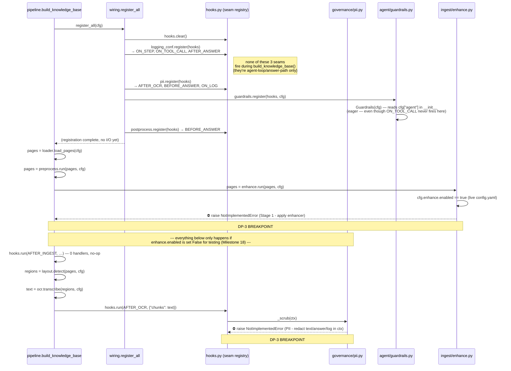

**Why `logging_conf.py`'s stub is *not* on this diagram as a breakpoint:** it's tempting to assume
every stub in `wiring.py`'s 4 registered features is equally dangerous, but `logging_conf.register()`
only attaches to `ON_STEP`, `ON_TOOL_CALL`, and `AFTER_ANSWER` — all three are seams that fire
**inside the agent loop** (`agent/agent.py::run()`) or at the end of `pipeline.answer()`, never
during `build_knowledge_base()`. Confirmed by reading `hooks.py`'s `SEAMS` list against exactly
which seams `build_knowledge_base()` itself calls (`AFTER_INGEST`, `AFTER_OCR`, `BEFORE_INDEX` —
three calls, `pipeline.py:16,19,21`). Drawing `logging_conf` as a third breakpoint here would be
inaccurate — it's a real stub, but not one that blocks knowledge-base building.

---

## 4. Evidence-tier propagation — one field, three renames, four files

Tracing a single line's quality signal from OCR through to the final index illustrates why the
Milestone 1 bug (reading `"tier"` where `"evidence_tier"` was written) was so easy to introduce and
so fatal once it was:

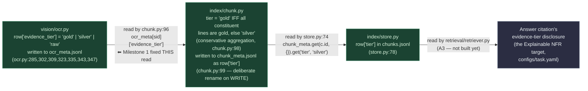

**The key/name is NOT the same string at every stage, and that's intentional, not sloppy:**
`ocr_meta.jsonl` uses `"evidence_tier"` (Stage 3's own field name, chosen to distinguish it from any
future `"tier"` concept at other stages); `chunk_meta.jsonl` and `chunks.jsonl` both use the shorter
`"tier"` (Stage 4's aggregated, chunk-level concept — deliberately renamed on write, per
`chunk.py`'s own comment, *not* a second instance of the same bug). Milestone 1's fix only touched
the **read** side inside `chunk.split()` — the write-side rename into `chunk_meta.jsonl`'s `"tier"`
key was already correct and is exactly what `store.py:78` expects.

---

## 5. Config-vs-code drift (flagged, not silently "fixed")

None of these are index/chunk/embed/store's files to edit — flagged here because an accurate
pipeline diagram has to draw what the code *does*, not what `config.yaml`'s `model:` field *claims*.

| Config key | `configs/config.yaml` says | What the code (`vision/*.py`) actually calls | Owner |
|---|---|---|---|
| `ocr.model` | `"microsoft/trocr-base-printed"` | `pytesseract` (Tesseract-ben) unconditionally, regardless of this value | OCR/vision |
| `layout.model` | `"detectron2:layout"` | `pytesseract.image_to_data` word/line grouping — no Detectron2 import anywhere in `layout.py` | OCR/vision |
| `enhance.enabled` (live value) | `true` | `configs/design_choices.md`'s Stage 1 row still documents `false` | Ingest (doc, not code) |

This diagram's Section 1/2 boxes are drawn against **the real code path** (Tesseract, `enhance.enabled: true`)
in every case above — not against the config file's `model:` strings, which would misrepresent what
actually executes.

---

## 6. Real artifacts, file by file

| File | Written by | Read by | Row shape |
|---|---|---|---|
| `data/processed/<doc_id>/<page_id>.png` | `preprocess.run` | `layout.detect`, `ocr.transcribe` | binarized image |
| `data/processed/layout_meta.jsonl` | `layout.detect` | `ocr.transcribe` (provenance check) | `region_id, page_id, bbox, block/par/line_num` |
| `data/processed/ocr_meta.jsonl` | `ocr.transcribe` | `chunk.split` | `region_id, chunk_id, page_id, ocr_confidence, cer, cer_threshold, ocr_config, ocr_text_raw, ocr_text_normalized, reference_text_normalized, evidence_tier, accepted, reject_reason` |
| `data/processed/chunk_meta.jsonl` | `chunk.split` | `store.build` | `chunk_id, ocr_confidence, tier, source_line_ids` |
| `data/processed/index/index.faiss` | `store.build` | `store.load` (→ A3 `retriever.py`) | FAISS binary index, `METRIC_INNER_PRODUCT` |
| `data/processed/index/chunks.jsonl` | `store.build` | `store.load` (→ A3 `retriever.py`) | `id, doc_id, text, page_ids, ocr_confidence, tier` — row *i* ↔ FAISS internal id *i* |

All six are gitignored (per-machine, rebuilt by `scripts/build_index.sh`) — none of them are
expected to exist in a fresh clone until `make ingest index` (or the equivalent test fixtures used
throughout `tests/test_retrieval.py`) has actually run.
